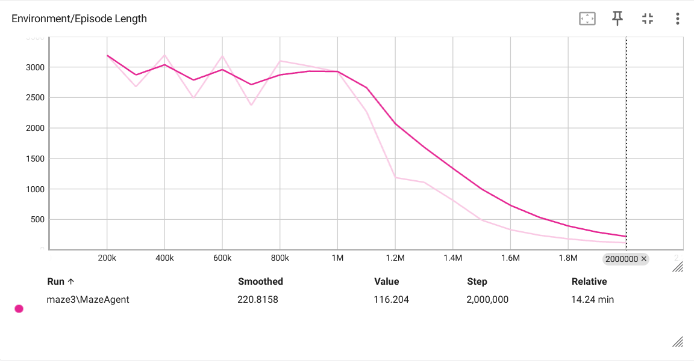

# Lab 2
## Setup
The Setup is as follows. The agent observes its position, the target of the maze, as well as the agent's distance from walls. The distance measured as three ray-casts one directly ahead and the others 45 degrees to the left and right. 

The agent can move forward and backward, as well as turn left or right. The agent is biased to move forward. 

The agent is given a very big reward for hitting the target. It is penalized for touching walls and less so for walking around. The penalty for movement is proportional to the agents distance from the target, that is, the closer the agent is to the target, the better its score.

64 agents were trained simultaneously in the maze, they could not collide with each other. Upon hitting the target and being rewarded the episode would end. Otherwise it would end after 16000 actions(steps).

## Results

Below are my graphs.

At first the agents weren't doing so great and had a hard time getting to the target. Over time though a few of them accidentally found it. From there the agents very quickly learned how to reach the target and to optimize for speed as the learning rate decreased.

You'll see in the video that despite being penalized for hitting the wall, they tended to anyway as it was faster to rebound on the wall. If I cared more about hitting the wall I would either increase the penalty or decrease the reward for the target. Avoiding the wall was just to prevent agents from just going to the wall nearest to the target and just sitting there.